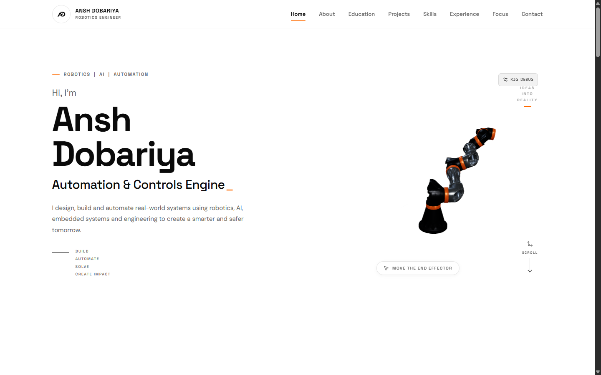

# Ansh Dobariya — Robotics Engineer Portfolio

<p align="center">
  <a href="https://anshdobariya.vercel.app">
    
  </a>
</p>

<p align="center">
  <a href="https://anshdobariya.vercel.app"><strong>🌐 Live Demo: anshdobariya.vercel.app</strong></a>
</p>

<p align="center">
  
  
  
  
  
</p>

---

## 🤖 Overview

Interactive, high-performance portfolio covering robotics, automation, embedded systems, and engineering. Built with a responsive 3D interactive 6-DOF robotic arm end-effector scene, sleek typography, and motion animations.

- **Live URL:** [https://anshdobariya.vercel.app](https://anshdobariya.vercel.app)
- **GitHub Repository:** [https://github.com/ansh141013/anshdobariya](https://github.com/ansh141013/anshdobariya)

---

## ⚡ Features & Interactivity

- **Interactive 3D Robot Arm:** Real-time Three.js canvas featuring a 6-DOF industrial robot arm responsive to pointer and end-effector target manipulation.
- **Physics & Control:** Pick/Place state controls and forward/inverse kinematics configuration.
- **Scroll Reveals:** Smooth GSAP & Framer Motion transitions.
- **Industrial Precision Aesthetic:** Crisp light/graphite theme with signature industrial orange accenting.
- **Responsive Layout:** Optimized across desktop, tablet, and mobile viewports.

---

## 🛠️ Tech Stack

- **Frontend:** React 19, TypeScript
- **3D Graphics:** Three.js, `@react-three/fiber`, `@react-three/drei`
- **Animation:** GSAP, Framer Motion
- **Styling:** Tailwind CSS
- **Bundler:** Vite 6
- **Deployment:** Vercel

---

## 🚀 Local Development

```bash
# Clone the repository
git clone https://github.com/ansh141013/anshdobariya.git

# Navigate into project directory
cd anshdobariya

# Install dependencies
npm install

# Start local development server
npm run dev
```

Build for production:
```bash
npm run build
```

---

## 👤 Author

**Ansh Dobariya**
- Portfolio: [anshdobariya.vercel.app](https://anshdobariya.vercel.app)
- GitHub: [@ansh141013](https://github.com/ansh141013)
- Email: [ansh.workspace31@gmail.com](mailto:ansh.workspace31@gmail.com)
